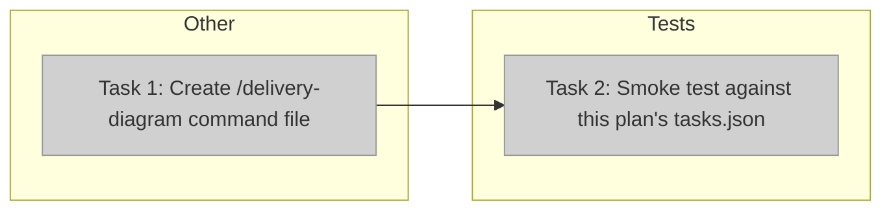

# Delivery Diagram

> Generated from `tasks.json`. Re-run `/delivery-diagram docs/plans/delivery-diagram-command` to regenerate.

```mermaid
flowchart LR

    classDef safe fill:#d0d0d0,color:#333,stroke:#999
    classDef risky fill:#ffb3b3,color:#333,stroke:#cc3333
    classDef gate fill:#fff,color:#333,stroke:#333,stroke-width:3px

    subgraph Other["Other"]
        t0[Task 1: Create /delivery-diagram command file]:::safe
    end

    subgraph Tests["Tests"]
        t1[Task 2: Smoke test against this plan's tasks.json]:::safe
    end

    t0 --> t1
```
