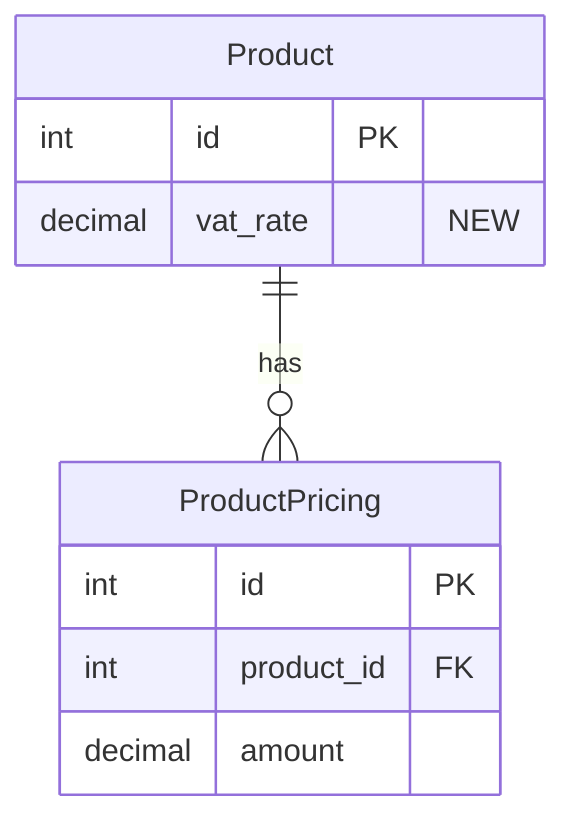

# Format Specifications

Detailed format specifications for technical sections of the Notion PRD.

## API Contract Changes Format

Document endpoint changes using this table format:

```markdown
### POST /api/v1/products/{id}/pricing

| Property       | Type    | Current  | Proposed | Change Type | Notes            |
| -------------- | ------- | -------- | -------- | ----------- | ---------------- |
| price.amount   | decimal | required | required | modified    | Now includes VAT |
| price.currency | string  | required | required | unchanged   |                  |
| price.vat_rate | decimal | -        | optional | added       | New field        |
```

## Database Model Changes Format

Document model changes with field details, indexes, constraints, and migration strategy:

```markdown
### Model: Product (products_product)

| Field    | SQL Type     | Django Field                                            | Current | Proposed | Change Type | Notes     |
| -------- | ------------ | ------------------------------------------------------- | ------- | -------- | ----------- | --------- |
| vat_rate | DECIMAL(5,2) | DecimalField(max_digits=5, decimal_places=2, null=True) | -       | added    | added       | New field |

**Indexes:**
| SQL | Django | Change Type | Notes |
|-----|--------|-------------|-------|
| CREATE INDEX idx_product_vat ON products_product(vat_rate) | models.Index(fields=['vat_rate'], name='idx_product_vat') | added | Filter by VAT |

**Constraints:**
| SQL | Django | Change Type | Notes |
|-----|--------|-------------|-------|
| CHECK (vat_rate >= 0 AND vat_rate <= 100) | CheckConstraint(check=Q(vat_rate__gte=0, vat_rate__lte=100), name='check_vat_rate_range') | added | Valid range |

**Migration Strategy:**

- Phase 1: Add nullable field (non-blocking)
- Backfill: [Script/data migration if needed]
- Phase 2: Remove deprecated fields after migration
- **Estimated migration time:** [estimate based on table size]
- **Locks required:** [None for nullable adds / describe if needed]
```

When models relate to each other, include a Mermaid ERD:



## Diagram Guidelines

Include Mermaid diagrams based on what the project involves:

- **Sequence diagrams** — Multiple services interacting (API calls, async flows)
- **Flowcharts** — Complex business logic with >3 decision points
- **State diagrams** — Core state management
- **ERD diagrams** — Database model relationships (see above)
- **Architecture diagrams** — Adding components or changing system boundaries

Only include diagrams that add clarity. Skip if the project is straightforward.

## Test Cases Format

Write acceptance criteria using Given/When/Then:

```markdown
**Scenario: [Descriptive name]**

- **Given** [precondition]
- **When** [action]
- **Then** [expected outcome]
```

Group test cases by category:

1. **Happy path** — Core functionality works
2. **Edge cases** — Boundary conditions
3. **Error cases** — Failure scenarios
4. **Regression** — Existing functionality still works
