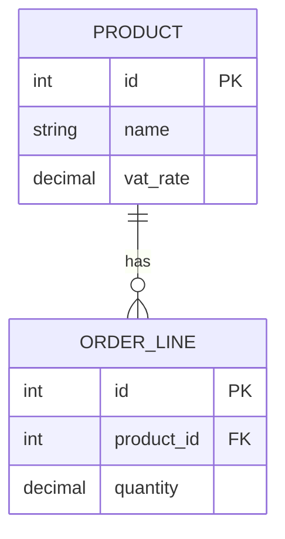

# Design Document Format References

## API Contract Changes

Use a table per endpoint. Only include endpoints that are changing.

```markdown
### POST /api/v1/products/{id}/pricing

| Property       | Type    | Current  | Proposed | Change Type | Notes            |
| -------------- | ------- | -------- | -------- | ----------- | ---------------- |
| price.amount   | decimal | required | required | modified    | Now includes VAT |
| price.currency | string  | required | required | unchanged   |                  |
| price.vat_rate | decimal | -        | optional | added       | New field        |
```

**Change Type values:** `added`, `modified`, `removed`, `unchanged`, `deprecated`

## Database Model Changes

Use a table per model/entity. Focus on the data model — no ORM-specific columns.

```markdown
### Entity: Product

| Field    | Type         | Current | Proposed | Change Type | Notes     |
| -------- | ------------ | ------- | -------- | ----------- | --------- |
| vat_rate | decimal(5,2) | -       | added    | added       | New field |

**Indexes:**
| Definition          | Change Type | Notes          |
| ------------------- | ----------- | -------------- |
| Index on (vat_rate) | added       | Filter by VAT  |

**Constraints:**
| Definition                            | Change Type | Notes       |
| ------------------------------------- | ----------- | ----------- |
| vat_rate >= 0 AND vat_rate <= 100     | added       | Valid range |

**Migration Strategy:**
- Phase 1: Add nullable field (non-blocking)
- Backfill: [Script/data migration if needed]
- Phase 2: Remove deprecated fields after migration
- **Estimated migration time:** [estimate based on table size]
- **Locks required:** [None for nullable adds / describe if needed]
```

## ERD Diagrams

Use Mermaid ERD syntax when entities relate to each other and a visual adds clarity.



## Diagram Guidelines

Use diagrams only when they genuinely add clarity beyond prose. Default to prose.

| Diagram type | Use when |
| ------------ | -------- |
| **Sequence** | Multiple systems interact in a specific order (auth flows, async messaging) |
| **Flowchart** | Decision logic with multiple branches (routing, retry logic) |
| **State**    | An entity transitions through distinct states (order status, job lifecycle) |
| **ERD**      | Multiple entities with relationships that are hard to describe in prose |
| **Architecture** | High-level component topology with external boundaries |

Omit the diagram if prose is equally clear. One well-placed diagram beats three mediocre ones.
