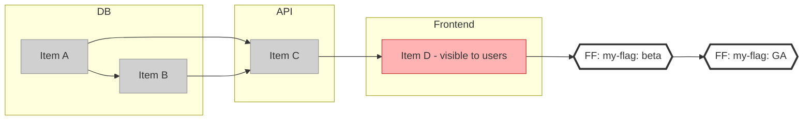
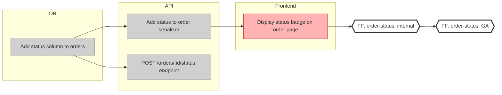

# Delivery Diagrams in Mermaid

## Overview

A delivery diagram breaks a feature into **atomic, individually deliverable engineering changes** (PRs, config changes, env vars, scripts) and shows their **dependency order** and **feature flag scope**.

Read left-to-right = deliver from start to finish. Items in the same column can be parallelized.

## Core Concepts

| Concept | What it is | Mermaid representation |
|---|---|---|
| **Item** | One atomic change (PR, migration, config) | Node `[text]` |
| **Safe item** | No direct end-user impact (DB tables, API endpoints, bg jobs) | Grey fill |
| **Risky item** | Visible to end users (UI changes, emails, env var affecting UX) | Red fill |
| **Swimlane** | Groups items by technical area (DB, API, Frontend) | `subgraph` |
| **Dependency** | B can't start until A is done | Arrow `A --> B` |
| **Feature flag gate** | Config change turning flag ON for a segment | `{{FF: flag-name: segment}}` node, outside subgraphs |

## Mermaid Template

## Key Rules

**Arrow direction:** Write `A --> B` to mean "B depends on A" (A must be done first). Items flow left-to-right. This is the reverse of the RFC's visual convention but gives the correct Mermaid layout.

**Color coding:**
- Grey (`#d0d0d0`) = safe to merge anytime, invisible to users
- Red (`#ffb3b3`) = detectable by end users, needs care

**Feature flag gates:**
- Place gates **outside all subgraphs** — they conceptually span all swimlanes
- Each gate = one configuration change of the flag (turning it on for a segment)
- Multiple gates = progressive delivery (beta → all users)
- Everything that depends on a gate (directly or transitively) is "behind" that flag
- Use hexagon shape `{{...}}` to visually distinguish gates from items
- Items that don't depend on any gate are **intentionally NOT behind the flag** — for example, a new DB column or serializer field that adds unused infrastructure can merge safely without a flag because users can't observe it

**Swimlanes:** Name by technical area (DB, API, Frontend, Jobs, Emails) or by domain concept (Invoices, Recommendations). Either works — consistency within a project matters more than a specific style.

## Worked Example

Feature: "Show order status to buyers"

Reading this diagram:
- `api1` and `api2` can be developed in parallel (both just need `db1`)
- `fe1` is red — it changes what buyers see
- Everything after `gate1` is behind the feature flag until GA

## Common Mistakes

| Mistake | Fix |
|---|---|
| Using blue for user-impact items | Use **red** (`#ffb3b3`) — RFC convention, signals caution |
| Putting gates inside a swimlane | Gates go **outside all subgraphs** — they span the whole diagram |
| Reversing arrows (`B --> A` where B depends on A) | Write `A --> B` — arrow tip points at the thing that gets unblocked |
| Creating a "Rollout" or "Gates" swimlane | No swimlane for gates — they're vertical separators in the RFC's model |
| Coloring all items the same | Always distinguish safe (grey) from risky (red) |
| Putting all items behind a flag | Some items (additive DB/API changes invisible to users) should be left before the gate — intentionally unflagged |
